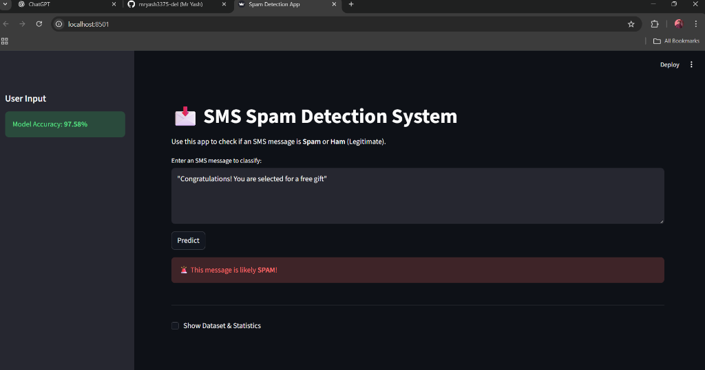

# Machine Learning Model Implementation: SMS Spam Detection

## 📌 Project Overview


This project implements a complete **Machine Learning pipeline** to classify SMS messages as **Spam** or **Ham** (Legitimate). It uses the **SMS Spam Collection Dataset** and applies Natural Language Processing (NLP) techniques with **Scikit-Leearn**.

## 📂 Project Structure
- `ml_model_project.ipynb`: The main Jupyter Notebook containing the code.
- `spam.csv`: The dataset used for training and testing.
- `requirements.txt`: List of Python dependencies.
- `README.md`: Project documentation.

## 🚀 Key Features
- **Data Preprocessing**: Handling missing values, duplicates, and Label Encoding.
- **NLP Techniques**: Text cleaning and **TF-IDF Vectorization** to convert text to numbers.
- **Exploratory Data Analysis (EDA)**: Visualization of spam distribution and message lengths.
- **Model Training**: Implementation of 5 ML algorithms:
    - Logistic Regression
    - Random Forest Classifier
    - Support Vector Machine (SVM)
    - Multinomial Naive Bayes (MNB)
    - K-Nearest Neighbors (KNN)
- **Evaluation**: Performance metrics including Accuracy, Precision, Recall, F1-Score, and Confusion Matrix.

## 🛠️ How to Run
1. **Install Dependencies**:
   ```bash
   pip install -r requirements.txt
   ```
2. **Launch Jupyter Notebook**:
   ```bash
   jupyter notebook ml_model_project.ipynb
   ```
3. **Run All Cells**: Execute the cells sequentially to see the analysis and results.

## 🖥️ Graphical Interface (GUI)
You can run the interactive web app to test the model yourself!

   ```bash
   python -m streamlit run app.py
   ```
This will open a local web page where you can enter any SMS message and get a prediction (Spam or Ham).

## 📊 Results Summary
The project compares multiple models to find the best classifier. typically, **Naive Bayes** and **SVM** perform best for text classification tasks like spam detection.

## 📝 Dataset
The dataset is the **SMS Spam Collection**, available publicly on the UCI Machine Learning Repository and Kaggle.
